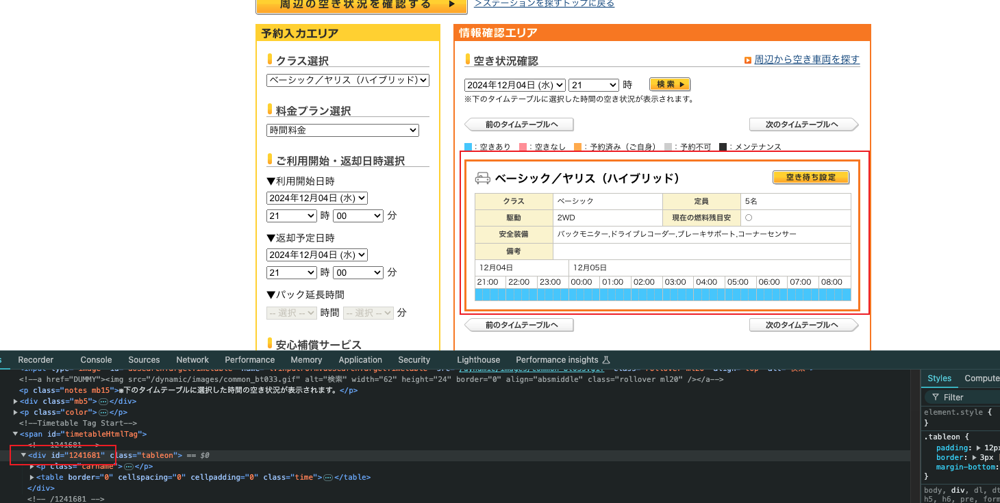

# Grab Times Car

## Overview

This is a simple bot that can help users to reserve a sharing car in advance.

### Warning

Although the cancellation of the reservation is supported and free, if you cancel too many times there is a risk that your account may be suspended.

## Prerequisites

- Times Car Membership
- Cloudflare Workers Account
- Node.js

## Development

### Clone this repository

```shell
$ git clone <repository-url>
```

### Install dependencies

```shell
$ npm install
```

### Create `config.json` with your own settings

Rename `config.sample.json` in `src` directory to `config.json`, then fill your own `SMART_PHONE_ID` and `IC_CARD_ID`.

`IC_CARD_ID` is your Times Car Membership ID.
`SMART_PHONE_ID` is the ID of your mobile phone. You need to get it by yourself.

Also, you need to fill compositions of `STATION_CD` and `CAR_ID` which you want to reserve.

About how to get `STATION_CD` and `CAR_ID`, please refer to the [Q & A](#q--a) section.

### Run the script locally

```shell
$ npm run dev
```

### Test the script

```shell
$ curl --location 'http://localhost:8787/__scheduled'
```

## Deployment

```shell
$ npm run deploy
```

## How do we know whether the reservation is successful?

If the reservation is successful, you will receive an email from Times Car. However, if the reservation is failed, there is no notifications for now. You need to check the logs of Cloudflare to figure out the reason.

## Q & A

### How to get your `SMART_PHONE_ID`?

You need to get it by capturing the HTTP request and response when you login the Times Car App. You can use tools like [Proxyman](https://proxyman.io/) or [Charles Proxy](https://www.charlesproxy.com/) to capture the request.

### How to get `STATION_CD` and `CAR_ID`?

Login the Times Car Website, [search](https://share.timescar.jp/view/station/search.jsp) and find the station you want to reserve. Then, you can get the `STATION_CD` from the URL.

The url of the reservation page is like `https://share.timescar.jp/view/reserve/input.jsp?scd=U118`. The `U118` is the `STATION_CD`.

On the reservation page, use the developer tools to inspect the list of cars. You will find the `CAR_ID` list in the `id` attribute of the `div` tag.


